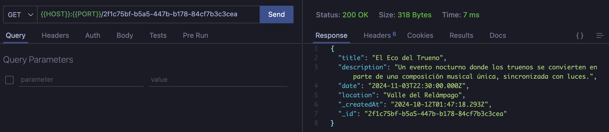

### Problemática:

La organización local necesita una solución eficiente para administrar y promover eventos.
Actualmente, no cuentan con una plataforma centralizada que permita a los usuarios acceder a
la información de los eventos, registrarse en ellos y recibir actualizaciones relevantes. Además,
los organizadores de eventos enfrentan dificultades para gestionar y controlar las inscripciones.
Por lo tanto, necesitas desarrollar una plataforma que resuelva estas problemáticas y brinde
una experiencia amigable tanto para los usuarios como para los organizadores.
Se necesita crear un servidor con Node y Express básico que disponga de 3 rutas una para la
creación de eventos que se añadan a una lista de eventos, y otra ruta para la obtención de un
evento en específico, debes considerar el uso de los métodos GET Y POST.
De manera opcional se solicita la modificación de un evento en específico, su eliminación y la
obtención de todos los eventos.
Requisitos:

- Editor de texto
- Node
- Express
- Postman
- Nodemon (opcional)

### Consideraciones generales

- Crea un nuevo directorio para el proyecto y navega hasta él utilizando la terminal.
- Inicializa el proyecto creando un package.json
- Utiliza Nodemon para realizar la ejecución del proyecto.
- Utiliza Postman para realizar las pruebas.
- Los eventos deben tener como mínimo: Titulo, descripción, fecha, lugar.

### Requerimientos del ejercicio:

- Crea un nuevo archivo llamado server.js en el directorio del proyecto.
- Genera un servidor básico de Node y express
- Dispone las rutas para la creación y la obtención de datos
- Obtén los parámetros necesarios desde las rutas dispuestas
- Implementa la lógica para la creación de los eventos con su título, descripción, fecha,
  ubicación, y añádelos a una lista
- Implementa la lógica para obtener información de los eventos, como su título, descripción,
  fecha, ubicación desde la lista creada
- Agrega por los menos 5 eventos
- Captura la ventana del Postman creando un evento
- Obtén el 3er evento y el 4to evento
- Toma una captura de los eventos obtenidos
- Añade las 3 capturas a una carpeta llamada “Evidencia” y comprime la carpeta del proyecto
  sin los node_modules.

## Evidencias

1. _POST: Creando un evento_


2. _GET: Todos los eventos_


3. _GET: Tercer evento_


4. _GET: Cuarto evento_



## Correr proyecto

1. Instalar dependencias

```bash
    npm install
```

2. Levantar servidor

```shell
    nodemon server.js
```
